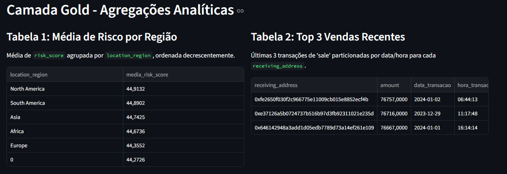
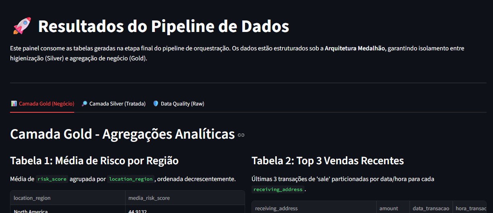
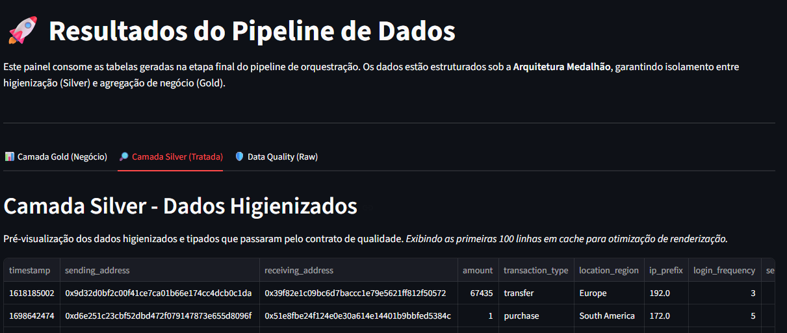
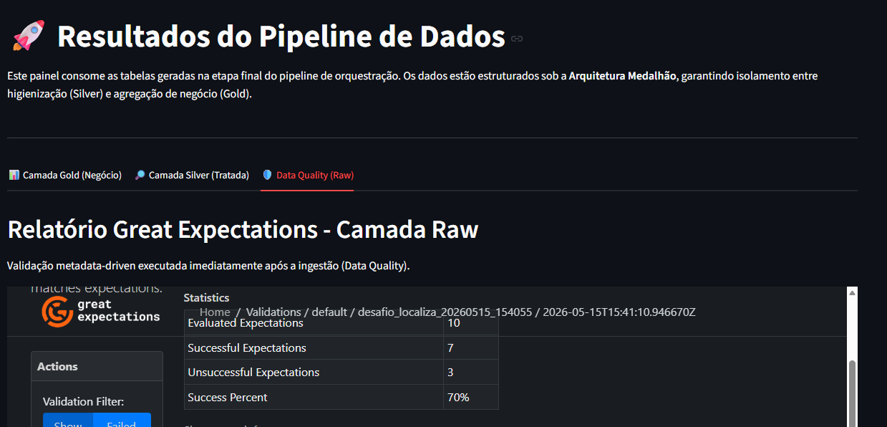

# 🚀 Pipeline de Dados - Desafio Técnico Localiza

Este repositório foi criado para o desafio técnico para engenheiro de dados sênior. Onde se procura aplicar conceitos de contratos de dados, processamento de alto desempenho e observabilidade no processo.

## O DESAFIO 
O objetivo técnico deste pipeline é orquestrar a ingestão de um arquivo CSV transacional e atender aos seguintes requisitos de negócio:
1. Importação e leitura do conjunto de dados.
2. Relatório automatizado de Data Quality para monitorar e expor anomalias na fonte.
3. Limpeza estrutural e higienização dos dados importados.
4. **Geração de duas tabelas-resultado analíticas**:
   - Tabela 1: Média de "risk_score" agrupada por "location_region", ordenada decrescentemente.
   - Tabela 2: Filtragem da transação mais recente do tipo 'sale' de cada 'receiving_address', retornando o top 3 dos endereços que movimentaram os maiores valores (amount) neste último evento.

## STACK TECNOLÓGICA 
* Motor de Processamento: Python 3.10 + Apache Spark (PySpark 3.5.0)
* Orquestração: Apache Airflow 2.8.1 (LocalExecutor)
* Data Quality: Great Expectations (Arquitetura Metadata-driven)
* Apresentação & Governança: Streamlit (Dashboard Analítico)
* Infraestrutura: Docker & Docker Compose

## 🚩**DECISÕES ARQUITETURAIS** 🚩 
### Decisões tomadas para o desafio

Para demonstrar senioridade e otimização de recursos, foram adotadas as seguintes estratégias estruturais:

1. Arquitetura Medalhão (Data Lakehouse):
O pipeline estrutura os dados em camadas lógicas progressivas de refinamento:
   - Camada Raw/Bronze (`data/input/`): Ingestão do arquivo bruto original para preservação da linhagem e imutabilidade histórica.
   - Camada Silver (`data/output/silver/`): Aplicação de contratos de qualidade e higienização estrutural. Os dados são persistidos em formato Parquet para acesso analítico rápido.
   - Camada Gold (`data/output/gold/`): Agregações finais e regras de negócio específicas, prontas para o consumo do painel de BI.

2. Data Quality (Great Expectations): O Great Expectations atua na camada Raw, logo após a ingestão. Validar o dado bruto antes da limpeza permite que o relatório de qualidade reflita a realidade exata da fonte, documentando anomalias que seriam mascaradas se a validação fosse pós-limpeza.
   * *Nota sobre a Severidade de Alertas (Modo Sandbox vs. Produção):* No pipeline deste desafio, as violações de contrato de dados emitem um log de nível `CRITICAL` na UI do Airflow, mas permitem que o fluxo continue. Esta foi uma decisão de design exclusiva para esta avaliação técnica (PoC/Sandbox), visando dar máxima visibilidade visual ao examinador sobre a capacidade de varredura das regras. Em um ambiente produtivo real com dados contínuos, essa severidade estaria atrelada a uma interrupção imediata da esteira (`sys.exit(1)`) ou ao desvio dos registros corrompidos para uma Dead Letter Queue (DLQ), mitigando o risco de corrupção do Data Lake.

3. Arquitetura Metadata-Driven: As regras de validação não estão "hardcoded". Elas residem em arquivos JSON (`gx/expectations/`), permitindo que as regras sejam dinâmicas sem necessidade de recompilar o código de processamento.

4. Processamento Local (Minimização de Overhead): Utilizou-se o Spark em modo local[*] embutido no container do Airflow. Isso elimina a necessidade de subir nós dedicados (Master/Worker), otimizando severamente o consumo de recursos na máquina avaliadora, refletindo uma engenharia focada na minimização de custos de infraestrutura.

5. Saneamento e Integridade Numérica:
    * Tipagem Decimal: Colunas amount e risk_score são tratadas como `DecimalType(38,4)` durante todo o pipeline para garantir exatidão matemática nas agregações.
    * Conversão Visual: A substituição de ponto por vírgula ocorre estritamente no estágio de saída, preservando a integridade das ordenações e agrupamentos no Spark.
    * Timestamp Unix: Conversão utilizando a função `from_unixtime` para otimizar I/O.

6. Desacoplamento de Granularidade Temporal (Timestamp): 
   - O requisito original para a Tabela 2 solicitava a manutenção da coluna "timestamp". Em vez de entregar o Unix Epoch bruto, desta forma derivei esse dado para duas novas colunas: "data_transacao" e "hora_transacao".
     - Justificativa Técnica: Em modelagem dimensional (Data Lakes/DW), expor o Epoch time na camada final de consumo gera atrito para analistas de BI e impede otimizações nativas. A separação semântica em Data e Hora permite que a tabela resultante (em Parquet) seja facilmente particionada por "data_transacao" no futuro, reduzindo o custo de I/O em consultas (Partition Discovery e Data Skipping) e entregando o dado pronto para uso em painéis de negócio.

7. Criação de um dashboard: para permitir visualizar os requisitos do desafio e tambem para analisar a silver e o resultado do Data Quality.

## ESTRUTURA DO PROJETO 
```text
desafio_localiza
├── dags/                # Definições de DAGs do Airflow
├── src/                 # Script principal de processamento PySpark
├── gx/                  # Metadados e Relatórios do Great Expectations
│   ├── expectations/    # Metadados referente ao contrato de dados
│   ├── uncommited/      # Relatorio do Great Expectations, em HTML
├── data/                # Arquivos de entrada e saida (Medalao)
│   ├── input/           # (Bronze) Arquivo CSV bruto original
│   ├── output/          # Tabelas finais em Parquet (Resultados)
│   |   ├── silver/      # Dados higienizados e tipados (Parquet)
│   |   └── gold/        # Tabelas finais de agregação (Parquet)
├── dashboard.py         # Dashboard Streamlit (Frontend/Apresentação)
├── docker-compose.yml   # Orquestração de containers, mapeamento de volumes e dashboard em Streamlit
├── Dockerfile           # Imagem enxuta (Airflow + OpenJDK 17 + Spark)
└── requirements.txt     # Dependências de processamento python
```

## CONTRATO DE DADOS (GREAT EXPECTATIONS) 
A validação de qualidade de dados foi projetada sob o paradigma Metadata-Driven. Ao invés de criar regras em código  PySpark, o pipeline consome um arquivo JSON estático que atua como o Contrato de Dados da camada Raw.

O escopo de validação do arquivo **`suite_desafio.json`** opera em três níveis distintos para garantir a integridade analítica:

1. Validação Estrutural e de Esquema:
   - "expect_column_to_exist": Valida a presença de colunas obrigatórias (ex: `amount`, `transaction_type`). Se a fonte alterar o layout, o pipeline reporta a falha antes de alocar processamento inútil no Spark.
   - "expect_column_values_to_be_in_type_list": Confirma se a tipagem inferida condiz com a expectativa matemática (Double/Float/Integer), essencial para colunas como `risk_score`.

2. Validação de Completude e Domínio (Row-Level):
   - "expect_column_values_to_not_be_null": Monitora a volumetria de nulos em chaves críticas (`receiving_address`, `location_region`).
   - "expect_column_values_to_be_in_set": Garante que o particionamento futuro faça sentido, limitando a `location_region` estritamente a ["Europe", "South America", "Asia", "Africa", "North America"] e isolando anomalias lógicas (como a string "0").

3. Validação de Padrão (Regex para Higienização):
   - "expect_column_values_to_match_regex": Na coluna `risk_score`, utiliza a expressão `^[0-9]+(\.[0-9]+)?$` para varrer linha a linha e identificar sujeiras em formato de texto (como a string "none" presente na origem). Essa validação em nível de linha é o que permite ao relatório HTML apontar o percentual exato de anomalias antes que o PySpark force o cast numérico.

## ⚡ AVALIAÇÃO RÁPIDA (FAST-TRACK)
Para otimizar o tempo de avaliação técnica, o repositório já vem provisionado com os principais artefatos finais pré-processados, dispensando a necessidade de execução inicial:

* **Camadas Silver e Gold (`data/output/`):** Os diretórios já contêm os arquivos Parquet estruturados, tipados e refinados prontos para análise.
* **Relatório de Data Quality (`gx/uncommitted/data_quality_report.html`):** O relatório HTML interativo gerado pelo Great Expectations está disponível para consulta imediata. Ele pode ser aberto diretamente em qualquer navegador para inspecionar os indicadores de conformidade, volumetria de nulos e as anomalias estruturais identificadas na fonte bruta.

A execução completa via Airflow (descrita abaixo) é totalmente suportada, idempotente e serve para demonstrar a engenharia de orquestração e robustez do ambiente produtivo.

## 📊 RESULTADOS DO DESAFIO (PREVIEW)
Abaixo estão as prévias em formato tabular dos artefatos gerados na camada Gold, atendendo estritamente aos requisitos de negócio solicitados:

### Tabela 1: Média de "risk_score" por "location_region" e Tabela 2: Top 3 transações mais recentes (sale) por "receiving_address"


## COMO EXECUTAR 

1. Inicialização:
    Na raiz do projeto, execute o comando abaixo no terminal para construir a imagem otimizada e subir os serviços:
    ```bash
    docker-compose up -d --build
    ```

2. Orquestração (Airflow):
Acesse http://localhost:8080 (Usuário/Senha: admin / admin).
   * Ative a DAG pipeline_localiza_desafio e dispare manualmente (Trigger DAG).
   * Acompanhe o processamento em tempo real através da aba Logs da task run_pyspark_and_dq. Os logs contornam o buffer padrão do Python via biblioteca logging, garantindo rastreabilidade técnica imersiva.

1. Visualização de Resultados (Dashboard):
    Acesse http://localhost:8081 para o portal interativo de resultados.
    * Aba **Camada Gold (Negócio)**: Visualização das tabelas do Desafio
    

    * Aba **Camada Silver (Tratada)**: Visualização da tabela dos dados tratados
    
    
    * Aba **Data Quality (RAW)**: Visualização interativa do Data Docs do Great Expectations (diagnóstico de anomalias da fonte).
    


## MELHORIAS FUTURAS

1. Roteamento para Dead Letter Queue (DLQ) / Quarentena:
Implementar uma bifurcação no fluxo do PySpark para que registros que violem o contrato de dados sejam desviados para uma tabela de "Quarentena", evitando a deleção silenciosa e permitindo auditoria pela equipe de Governança.

2. Telemetria de Baixo Custo (PySpark Observation):
Para escalas muito maiores de registros, a extração de métricas de qualidade seria migrada para a API nativa `Observation` do PySpark. Isso permite calcular metadados técnicos "pegando carona" na Action de gravação das informações finais em uma única passagem de memória (Single-Pass), reduzindo a fatura de compute (FinOps).

3. Evolução para Cargas Incrementais (Upsert): Em um cenário produtivo real com ingestão contínua, a gravação na camada Silver seria transicionada de *Overwrite* para *Upsert* (através da adoção de formatos de tabela transacionais como Delta Lake ou Apache Iceberg). Isso garantiria a atualização isolada de registros alterados na origem, eliminando a necessidade de reprocessamento full da base e otimizando os custos de I/O na nuvem.

## DESTAQUES DE EFICIÊNCIA NO CÓDIGO 
* Coalesce(1): Utilizado na escrita final para evitar a fragmentação de disco (Small Files Problem) neste ambiente de teste local.
* Pushdown Filters: Aplicados antes das Window Functions para reduzir a pegada de memória durante o shuffle.
* Idempotência: Uso de mode("overwrite") para garantir execuções consistentes.
  
---

## Desenvolvido por:

### Paulo Fernando Justino

**Engenheiro de Dados Sênior & Analista de Sistemas**

   

## 📫 Contato

<a href="mailto:Paulofernando.justino@gmail.com">
  
</a>
<a href="https://www.linkedin.com/in/paulo-justino-data/">
  
</a>

---