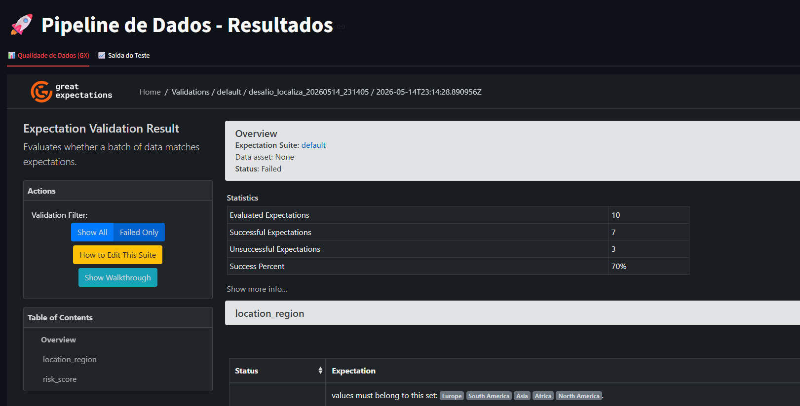
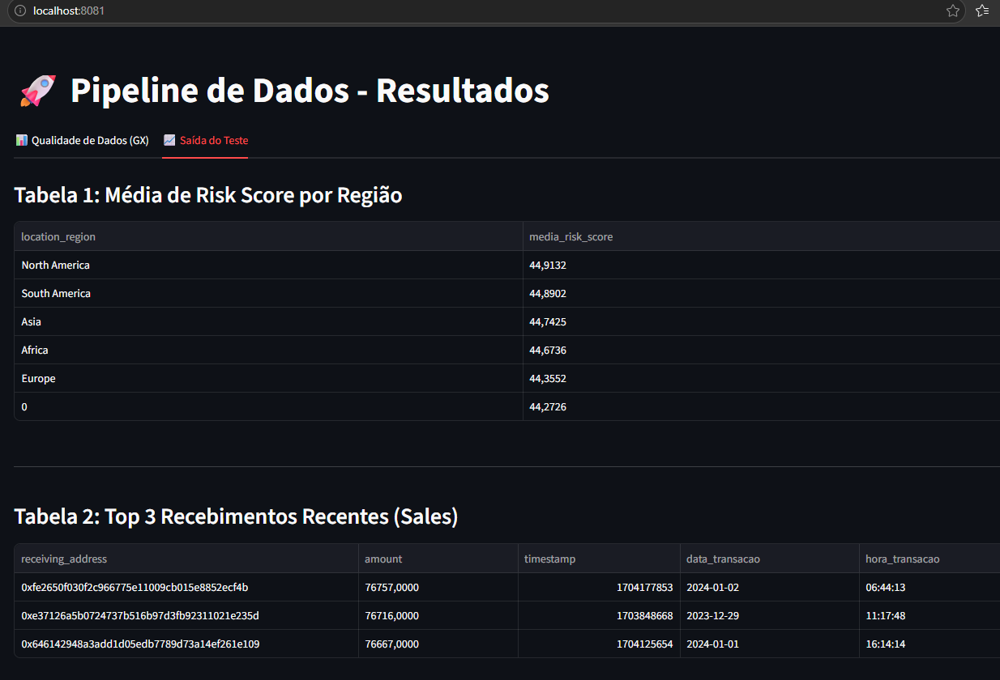

# 🚀 Pipeline de Dados - Desafio Técnico Localiza

Este repositório apresenta uma solução robusta e escalável para o desafio técnico de Engenharia de Dados. A arquitetura foi concebida sob os pilares de qualidade de dados automatizada, processamento de alto desempenho e observabilidade ponta a ponta.

## O DESAFIO 
O objetivo técnico deste pipeline é orquestrar a ingestão de um arquivo CSV transacional e atender aos seguintes requisitos de negócio:
1. Importação e leitura do conjunto de dados.
2. Relatório automatizado de Data Quality para monitorar e expor anomalias na fonte.
3. Limpeza estrutural e higienização dos dados importados.
4. **Geração de duas tabelas-resultado analíticas**:
   - Tabela 1: Média de "risk_score" agrupada por "location_region", ordenada decrescentemente.
   - Tabela 2: Top 3 transações mais recentes (timestamp) do tipo "sale" para cada "receiving_address", contendo o endereço, o valor (amount) e a data/hora.

## STACK TECNOLÓGICA 
* Motor de Processamento: Python 3.10 + Apache Spark (PySpark 3.5.0)
* Orquestração: Apache Airflow 2.8.1 (LocalExecutor)
* Data Quality: Great Expectations (Arquitetura Metadata-driven)
* Apresentação & Governança: Streamlit (Dashboard Analítico)
* Infraestrutura: Docker & Docker Compose

## DECISÕES ARQUITETURAIS (ADR) 
Para demonstrar senioridade e otimização de recursos, foram adotadas as seguintes estratégias estruturais:

1. Shift-Left Data Quality: O Great Expectations atua na camada Raw, logo após a ingestão. Validar o dado bruto antes da limpeza permite que o relatório de qualidade reflita a realidade exata da fonte, documentando anomalias (como registros 'phishing' ou tipos incorretos) que seriam mascaradas se a validação fosse pós-saneamento.

2. Arquitetura Metadata-Driven: As regras de validação não estão "hardcoded". Elas residem em arquivos JSON (gx/expectations/), permitindo que as regras sejam dinâmicas sem necessidade de recompilar o código de processamento.

3. Processamento Local (Minimização de Overhead): Utilizou-se o Spark em modo local[*] embutido no container do Airflow. Isso elimina a necessidade de subir nós dedicados (Master/Worker), otimizando severamente o consumo de recursos na máquina avaliadora, refletindo uma engenharia focada na minimização de custos de infraestrutura.

4. Saneamento e Integridade Numérica:
    * Tipagem Decimal: Colunas amount e risk_score são tratadas como DecimalType(38,4) durante todo o pipeline para garantir exatidão matemática nas agregações.
    * Conversão Visual: A substituição de ponto por vírgula ocorre estritamente no estágio de saída, preservando a integridade das ordenações e agrupamentos no Spark.
    * Timestamp Unix: Conversão nativa com a função C do Spark (from_unixtime) para otimizar I/O.

5. Desacoplamento de Granularidade Temporal (Timestamp): 
O requisito original para a Tabela 2 solicitava a manutenção da coluna "timestamp". Em vez de entregar o Unix Epoch bruto, a arquitetura derivou esse dado para duas novas colunas: "data_transacao" e "hora_transacao".
Justificativa Técnica: Em modelagem dimensional (Data Lakes/DW), expor o Epoch time na camada final de consumo gera atrito para analistas de BI e impede otimizações nativas. A separação semântica em Data e Hora permite que a tabela resultante (em Parquet) seja facilmente particionada por "data_transacao" no futuro, reduzindo o custo de I/O em consultas (Partition Discovery e Data Skipping) e entregando o dado pronto para uso em painéis de negócio.

## ESTRUTURA DO PROJETO 
```
desafio_localiza
├── dags/                # Definições de DAGs do Airflow
├── src/                 # Script principal de processamento PySpark
├── gx/                  # Metadados e Relatórios do Great Expectations
├── data/
│   ├── input/           # Ingestão (Arquivo CSV bruto)
│   └── output/          # Tabelas finais em Parquet (Resultados)
├── dashboard.py         # Dashboard Streamlit (Frontend/Apresentação)
├── docker-compose.yml   # Orquestração de containers e mapeamento de volumes
├── Dockerfile           # Imagem enxuta (Airflow + OpenJDK 17 + Spark)
└── requirements.txt     # Dependências de processamento python
```

## CONTRATO DE DADOS (GREAT EXPECTATIONS) 
A validação de qualidade de dados foi projetada sob o paradigma Metadata-Driven. Em vez de hardcodar regras (If/Else) dentro do script PySpark, o pipeline consome um arquivo JSON estático que atua como o Contrato de Dados da camada Raw. 

O escopo de validação do arquivo `suite_desafio.json` opera em três níveis distintos para garantir a integridade analítica:

1. Validação Estrutural e de Esquema:
   - "expect_column_to_exist": Valida a presença de colunas obrigatórias (ex: `amount`, `transaction_type`). Se a fonte alterar o layout, o pipeline reporta a falha antes de alocar processamento inútil no Spark.
   - "expect_column_values_to_be_in_type_list": Confirma se a tipagem inferida condiz com a expectativa matemática (Double/Float/Integer), essencial para colunas como `risk_score`.

2. Validação de Completude e Domínio (Row-Level):
   - "expect_column_values_to_not_be_null": Monitora a volumetria de nulos em chaves críticas (`receiving_address`, `location_region`).
   - "expect_column_values_to_be_in_set": Garante que o particionamento futuro faça sentido, limitando a `location_region` estritamente a ["Europe", "South America", "Asia", "Africa", "North America"] e isolando anomalias lógicas (como a string "0").

3. Validação de Padrão (Regex para Higienização):
   - "expect_column_values_to_match_regex": Na coluna `risk_score`, utiliza a expressão `^[0-9]+(\.[0-9]+)?$` para varrer linha a linha e identificar sujeiras em formato de texto (como a string "none" presente na origem). Essa validação em nível de linha é o que permite ao relatório HTML apontar o percentual exato de anomalias antes que o PySpark force o cast numérico.
   - 
## COMO EXECUTAR 
1. Inicialização:
Na raiz do projeto, execute o comando abaixo no terminal para construir a imagem otimizada e subir os serviços:
docker-compose up -d --build

2. Orquestração (Airflow):
Acesse http://localhost:8080 (Usuário/Senha: admin / admin).
* Ative a DAG pipeline_localiza_desafio e dispare manualmente (Trigger DAG).
* Acompanhe o processamento em tempo real através da aba Logs da task run_pyspark_and_dq. Os logs contornam o buffer padrão do Python via biblioteca logging, garantindo rastreabilidade técnica imersiva.

3. Visualização de Resultados (Dashboard):
Acesse http://localhost:8081 para o portal interativo de resultados.
* Aba Qualidade: Visualização interativa do Data Docs do Great Expectations (diagnóstico de anomalias da fonte).

* Aba Saída do Teste: Visualização nativa das tabelas-resultado (Média por Região e Top 3 Sales) geradas no formato Parquet, sem necessidade de ferramentas de terceiros para o RH ou Avaliador ler os arquivos.


## DESTAQUES DE EFICIÊNCIA NO CÓDIGO 
* Pushdown Filters: Aplicados antes das operações de Window Functions para reduzir a pegada de memória durante o shuffle do PySpark.
* Idempotência: O pipeline limpa a área de output com mode("overwrite") e utiliza coalesce(1) para evitar fragmentação de disco em pequenos lotes.
* Docker Healthchecks: Prevenção de Crash Loops com monitoramento de serviço de banco (Postgres) diretamente no Compose.
  
---